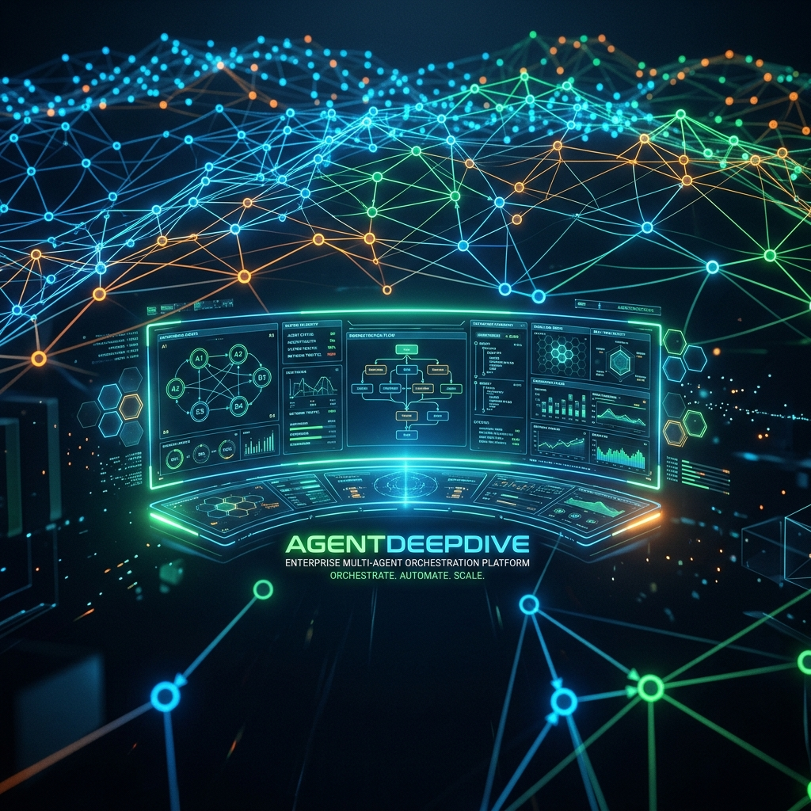

# 🤖 AgentDeepDive

**Multi-Agent Orchestration Platform for Super Engineering**  
*面向超级工程的企业级多 Agent 编排与协同执行平台*



---

中文 | [English](README.en.md)

[](LICENSE)
[](pyproject.toml)
[]()
[]()

AgentDeepDive 是一款为复杂、多阶段、高安全要求的大型超级工程设计的多代理（Multi-Agent）编排与协作执行平台。它将任务分解、并发调度、多通道人工审批（HITL）、安全沙箱隔离与自我进化机制深度融合，提供生产就绪级别的智能体协同体验。

---

## 🌟 核心特性 (Core Features)

1. **分布式 DAG 编排引擎 (DAG Orchestration)**
   * **动态分解**：自动将复杂的超级工程目标分解为有向无环图（DAG）任务节点。
   * **并发调度**：支持多分支节点并发执行、前置依赖自动注入与数据流向传递。
   * **状态恢复**：支持在执行中断、异常时，从指定节点触发状态恢复与重新执行。
2. **多通道审批机制 (HITL Gateway)**
   * **人机协同**：内置 L3 级人工介入（Human-in-the-loop）审批网关。
   * **多渠道授权**：支持通过 Slack, Discord, 微信等多终端推送审核通知并接收一键安全授权。
3. **安全沙箱与 Sentinel 回收机制**
   * **物理隔离**：基于 Docker 隔离的独立执行沙箱，杜绝代码执行污染宿主机。
   * **Sentinel 守护**：背景守护进程 Sentinel 实时监控沙箱健康度，自动清理僵尸容器与挂起资源（GC）。
4. **零容器轻量化运行模式 (Lightweight Mode)**
   * **开箱即用**：提供一键轻量模式（`-l` / `--lightweight`），使用本地 SQLite、FAISS 与文件锁（File Locks）替代重量级云原生数据库与中间件，极大地降低开发调试门槛。
5. **企业级安全治理 (OPA & Rego)**
   * **动态合规**：内嵌 OPA (Open Policy Agent) 微隔离安全网关，通过 Rego 策略动态扫描并阻断高风险系统与文件操作。
   * **隐私保护**：内置防泄漏 API Key 屏蔽机制与防篡改密码学审计日志（Cryptographic Audit Trail）。
6. **可视化 Cockpit 仪表盘 (Visual Dashboard)**
   * **交互式画布**：集成 React Flow 拓扑画布，多色展示执行生命周期节点状态（未开始/运行中/成功/挂起/失败）。
   * **悬浮遥测**：支持节点悬浮气泡遥测（Telemetry）面板展示，实时查看执行日志与变量上下文。
7. **自演进飞轮与 E2E 验证 (Self-Evolution)**
   * **自动纠错**：具备自演进飞轮（Self-Evolution Flywheel），支持多文件 AST 语法编译检查及策略优化。
   * **pytest 保护**：自动执行单元与端到端测试套件，杜绝潜在代码缺陷发布。

---

## 📁 目录结构 (Repository Structure)

```text
AgentDeepDive/
├── src/
│   ├── core/           # 核心引擎 (编排器、技能服务、代理沙箱、锁管理、安全策略等)
│   ├── evolution/      # 自演进飞轮 (自我诊断与策略优化)
│   ├── api/            # FastAPI Web 路由与 WebSocket 事件流
│   └── cli/            # 命令行开发工具 (基于 Click 框架)
├── dashboard/          # React + Vite + React Flow 可视化大屏前端
├── skills/             # 预定义/动态注册智能体技能定义 (YAML)
├── docker/             # PostgreSQL, Redis, Milvus, OPA, Jaeger compose 配置文件
├── tests/              # 单元测试与 E2E 验证套件
├── docs/               # 详尽的技术设计白皮书与架构规划
└── LICENSE             # MIT 授权协议
```

---

## 🏛️ 系统微服务架构与容器角色 (System Microservices & Containers)

在标准容器部署或 Kubernetes (K8s) 环境下，AgentDeepDive 拆分为以下核心功能容器协作运行：

*   **`agentdeep-api` (控制面 / API Server)**：基于 FastAPI，负责提供 Web API 接口、WebSocket 状态推送、接收大图编排调度指令并管理工作流的元数据存储与定时任务触发。
*   **`agentdeep-worker` (计算面 / Celery Worker)**：负责监听 Redis 中的任务队列，真正执行复杂的 DAG 任务图拓扑调度、运行大模型调用逻辑，并在 OPA 安全沙箱中调用工具，支持计算的高并发水平扩展。
*   **`agentdeep-beat` (定时调度触发器)**：基于 Celery Beat，定时轮询数据库，将到期的定时执行任务推入 Redis 消息中心，保障定时流按时派发。
*   **`redis` (消息代理 / Broker)**：作为 Celery 的消息通道，实现 API 控制面与多个计算 Worker 之间的解耦和任务异步分发。
*   **`postgres` (关系数据库)**：持久化存储租户信息、Agent 定义、编排好的 DAG 拓扑结构、历史执行明细与安全审计轨迹。
*   **`jaeger` (链路遥测 / APM)**：收集并图形化展示分布式链路追踪 Trace，方便追溯每个 Agent 在复杂推理与工具调用链中的延迟与报错。

对于系统级依赖服务环境（PostgreSQL, Redis, Milvus, OPA, Jaeger）以及代码各功能模块（CentralBrain, DAGEngine, AdaptiveRouter, Sentinel 等）的详尽科普介绍，请参阅 [系统基础环境与功能模块手册 (system_components_and_environments.md)](docs/system_components_and_environments.md)。

对于 Kubernetes (K8s) 集群原生的管理组件角色科普，请参阅 [K8s 部署指南 (kubernetes_deployment_guide.md)](docs/deployment/kubernetes_deployment_guide.md)。

---

## 🤖 编程助手一键引导 (One-Line Setup for AI Agents)

如果您使用 **Claude Code**, **Cursor**, **Windsurf** 或其他 AI 编码助手，可将以下 Prompt 直接发送给它：

```text
Help me bootstrap AgentDeepDive for local development by following the guides in README.md and INSTALL.md
```

AI 助手将自动识别目录结构、检查环境依赖并依次运行所需的初始化命令。

---

## 🚀 快速开始 (Quick Start)

对于详细的步骤、多租户配置与依赖项调优，请参阅 [安装指南 (INSTALL.zh.md)](INSTALL.zh.md)。

### 1. 基础环境准备
* Python 3.11+
* Docker & Docker Compose

### 2. 依赖安装与虚拟环境
```bash
python3 -m venv .venv
source .venv/bin/activate
pip install -e ".[dev]"
```

### 3. 环境变量配置
```bash
cp .env.example .env
# 编辑 .env 配置所需的 SaaS 模型 API 密钥及三方渠道 Token
```

### 4. 运行模式选择

AgentDeepDive 支持两种运行模式：

#### A. 标准容器模式 (推荐生产/完整环境)
```bash
# 1. 启动基础设施服务 (包含 PostgreSQL, Redis, Milvus, OPA)
agentdeep infra up

# 2. 数据库迁移与初始化
agentdeep db upgrade head

# 3. 启动 FastAPI API 接口服务
uvicorn src.api.main:app --reload --host 0.0.0.0 --port 8000
```

#### B. 零容器轻量模式 (适合离线测试/轻量开发)
运行 CLI 命令时附加 `-l` / `--lightweight` 选项，系统将自动重写数据库与中间件为本地 SQLite 和 FAISS 文件：
```bash
agentdeep run "开发一个简单的扫雷游戏" -l
```

---

## 📊 部署规格建议 (Deployment Sizing)

以下是运行 AgentDeepDive 的推荐配置建议：

| 部署模式 | 推荐规格 | 适用场景 | 依赖组件 |
| :--- | :--- | :--- | :--- |
| **轻量化开发 (Lightweight)** | 2 vCPU / 4 GB | 离线评估、CLI 脚本调试、轻量级技能开发 | 本地 SQLite, FAISS, 文件锁 |
| **标准单机 (Standard Container)** | 4 vCPU / 8 GB | 团队多用户协作、全功能集成测试、可视化 Cockpit 使用 | Docker, PostgreSQL, Redis, Milvus, OPA |
| **高可用生产 (HA Production)** | 8 vCPU / 16 GB+ | 企业级工作流编排、高并发执行沙箱、严格 OPA 策略扫描 | 外部数据库群集、K8s 沙箱隔离、集中式 Jaeger 遥测 |

*注：以上规格不包含托管本地 LLM（例如通过 vLLM 运行 Llama 3/DeepSeek）。若本地运行大模型，请根据显卡配置另行规划。*

---

## 🛠️ 核心配置文件 (`config.yaml`) 示例

以下展示了如何在核心配置文件 `config.yaml` 中配置大语言模型及中间件策略（系统支持 OpenAI, Claude, Gemini, DeepSeek 以及基于 vLLM 部署的开源大模型）：

```yaml
# AgentDeepDive 核心配置
app:
  name: "AgentDeepDive"
  env: "development"

# 模型管理器配置
models:
  default: "gemini-1.5-pro"
  providers:
    openai:
      api_key: "${OPENAI_API_KEY}"
      base_url: "https://api.openai.com/v1"
    gemini:
      api_key: "${GEMINI_API_KEY}"
    deepseek:
      api_key: "${DEEPSEEK_API_KEY}"
      base_url: "https://api.deepseek.com"
    vllm:
      api_key: "placeholder"
      base_url: "http://localhost:8000/v1"

# 编排与沙箱隔离配置
sandbox:
  mode: "docker" # 可选: docker / local
  docker:
    image: "agentdeepdive-sandbox:latest"
    cpu_limit: 2.0
    memory_limit: "4g"
  sentinel:
    enabled: true
    gc_interval_seconds: 60

# 安全策略配置 (OPA)
security:
  opa:
    enabled: true
    url: "http://localhost:8181/v1/data/agent_policy"
  audit:
    cryptographic_integrity: true
```

---

## 🛠️ CLI 命令行工具指南 (CLI Reference)

AgentDeepDive 的命令行工具是开发者的核心交互手段。支持智能自适应模式（自检本地/远程 API 连接状态）。

### 基础设施管理 (`agentdeep infra`)
* `agentdeep infra up` — 启动全部云原生 Docker 容器（数据库、向量库、缓存）。
* `agentdeep infra status` — 实时监控容器状态及映射端口。
* `agentdeep infra stop` — 仅停止容器运行而不销毁容器，数据安全。
* `agentdeep infra start` — 唤醒已停止的基础设施容器。
* `agentdeep infra down` — 停止并销毁容器，输出数据持久性安全通告（数据卷保留）。
* `agentdeep infra reset` — 清理全部容器并彻底擦除本地持久化命名数据卷（慎用）。

### 任务执行与编排
* `agentdeep run "TASK_DESCRIPTION" [-l]` — 提交单步任务，支持直接指定轻量模式。
* `agentdeep dag split "TASK_DESCRIPTION" [-l]` — 自动将超级工程任务分解并生成 DAG。
* `agentdeep dag execute [DAG_ID] [-f FILE.yaml] [-l]` — 提交并并行执行指定 DAG，支持文件加载。

### 人工审批与诊断
* `agentdeep approval list` — 查看挂起待审核的 L3 任务节点。
* `agentdeep approval approve <TASK_ID>` — 批准挂起执行的安全/变更操作。
* `agentdeep doctor` — 本地服务与网络连接环境一键自诊断。

---

## 📊 Cockpit Dashboard (大屏可视化前端)

可视化仪表盘能直观展示任务拓扑的流动过程。
```bash
cd dashboard
npm install
npm run dev
```
打开 `http://localhost:5173` 即可进入控制台，体验 React Flow 交互画布、一键任务恢复（Restore Task）以及 OPA 策略审计遥测详情。

---

## ⚠️ 安全须知 (Security Notice)

1. **沙箱隔离**：在生产环境中，请务必启用 `docker` 模式的沙箱。严禁以 `local` 模式运行不受信任的多智能体技能，否则可能会对宿主机造成破坏。
2. **OPA 策略**：建议为生产系统配置严格的 OPA Rego 校验策略，限制智能体执行高危操作（如 `rm -rf /`，更改系统端口或访问未授权资源）。
3. **密钥管理**：请确保 `.env` 文件被包含在 `.gitignore` 中，防止 API Key、Slack Token 等凭证泄漏至公开代码仓。

---

## 🤝 参与贡献 (Contributing)

我们非常欢迎社区开发者为 AgentDeepDive 做出贡献！无论是修复 Bug、完善文档、还是提交新的技能定义，您都可以通过以下方式参与：
1. Fork 本仓库并创建您的特性分支 (Feature Branch)。
2. 提交代码并确保 pytest 套件及 AST 检查全部通过。
3. 提交 Pull Request，我们的审核团队会尽快给您答复。

---

## 📄 开源许可证 (License)

本项目采用 **[MIT License](LICENSE)** 协议开源。
