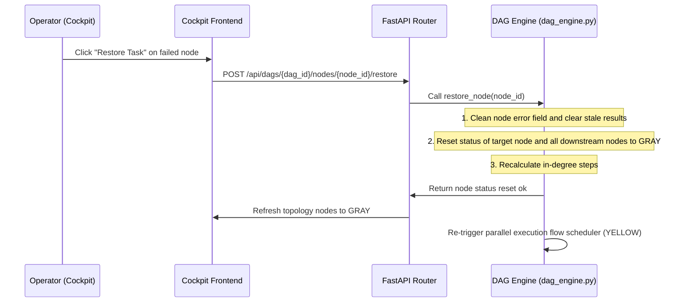

# Cockpit Dashboard User and Extension Guide

This guide details the core panels of the AgentDeepDive Cockpit UI console, the Human-in-the-Loop (HITL) approval dialog workflow, the **Breakpoint Recovery (Restore Task) mechanics**, and guidelines for extending UI nodes and telemetries.

---

## 1. Cockpit UI Console Overview

The Cockpit dashboard is built on **React + Vite + TypeScript** and utilizes **React Flow** to render task topologies. It communicates with the backend via **FastAPI WebSockets** to fetch real-time Server-Sent Events (SSE) and provide a glass-cockpit view of agent actions.

### 1.1 Communication Architecture

```text
+-------------------+             WebSocket (Log Event Stream)             +-----------------------+
|                   | <=================================================== |                       |
|                   |            HTTP POST (Restore / Approve)            |    FastAPI Server     |
|   Cockpit UI      | ---------------------------------------------------> |                       |
|   (React Flow)    |                                                      |  (src/api/routes/)    |
|                   | <--------------------------------------------------- |                       |
+-------------------+              HTTP GET (DAG & Skill State)            +-----------------------+
```

---

## 2. Core Dashboard Panels

The UI consists of modular components:

### 2.1 Mission Control & Topology Nodes (`MissionControl.tsx` & `CustomNode.tsx`)
* **DAG Rendering**: Renders Directed Acyclic Graphs representing node hierarchies and dependencies.
* **Custom Node Color States**: `CustomNode.tsx` handles node styling, using borders and status halos to represent state machine colors (Gray: waiting, Blue: queued, Yellow: running, Green: completed, Red: failed, Orange: approval pending).
* **Hover Telemetry**: Hovering over a node displays its input arguments, duration, output JSON structures, and error traceback details.

### 2.2 Approval Gate Dialogs (`ApprovalDialog.tsx` & `ApprovalGate.tsx`)
* When an execution triggers a **L3 risk level** (due to OPA policies or `approval_required: true` in the skill definition), the node turns **Orange (ORANGE)** and pauses.
* The approval dialog displays the pending action details (e.g., the exact command or file write target).
* Administrators can click **"Approve"** or **"Reject"** to resume or terminate the execution thread.

### 2.3 Log Telemetry (`LogTelemetry.tsx`)
* Fetches log stdout/stderr streams from active sandboxes and background Sentinel processes via WebSockets.
* Supports filtering, search, log-level color-coding, and auto-scroll tracking to reveal the agent's Chain of Thought.

### 2.4 Policy Editors & Health Diagnostics (`OpaPolicyDialog.tsx` & `DiagnosticsDialog.tsx`)
* **OPA Policy Manager**: Views and monitors active OPA Rego rules (`guardrails.rego`) directly from the UI.
* **Diagnostics Panel**: Invokes the `agentdeep doctor` API, rendering connection health states for the sandboxes, PostgreSQL, Redis, Milvus, and Jaeger.

---

## 3. Breakpoint Recovery (Restore Task) Mechanics

If a node fails during execution, it turns **Red (RED)** and the engine suspends downstream execution paths. Cockpit supports **one-click Breakpoint Recovery (Restore Task)** to recover tasks.

### 3.1 Restore Mechanics Sequence



---

## 4. Frontend Extension Development

To customize the Cockpit dashboard:

### 4.1 Adding Custom Node Telemetry Metrics (`CustomNode.tsx`)
To display custom telemetry on nodes (e.g., CPU load or RAM consumption during runs):
1. Add custom properties to the Node interface in `CustomNode.tsx`:
   ```typescript
   interface CustomNodeData {
     label: string;
     status: string;
     cpuUsage?: string;  // Custom CPU usage percentage metric
     // ...
   }
   ```
2. Render the metric in the Node template:
   ```tsx
   {data.cpuUsage && (
     <div className="text-xs text-gray-400 mt-1">
       CPU: <span className="text-neon-green">{data.cpuUsage}</span>
     </div>
   )}
   ```

### 4.2 Creating Sandbox Preview Panels
For output assets (like HTML pages written by `file_write`), you can render an inline iframe preview panel on the sidebar:
1. Listen to WebSocket events, checking if `tool_name` is `file_write` and `target_path` ends with `.html`.
2. Mount an `<iframe>` container on the sidebar pointing to the static asset server, allowing users to view and interact with generated web UIs (e.g., the Snake game) inside the console.

---

## 5. Deployment and Troubleshooting

### 5.1 Local Launch Steps
Ensure the FastAPI Uvicorn server is running on port `8000`:
```bash
cd dashboard
npm install
npm run dev
```
The dev server launches on `http://localhost:5173`. Proxies configured in `vite.config.ts` forward `/api` and `/ws` requests to the backend server.

### 5.2 Troubleshooting
* **Blank screen / WebSocket connection failed**
  * **Fix**: Ensure the FastAPI backend is running. If deployed remotely, update `vite.config.ts` proxy parameters to point to the server's external IP address.
* **Restore Task fails with 404**
  * **Fix**: Restore is only valid for `RED` or `SUSPENDED` nodes. Check the node state in the hover telemetry panel. Check `server.log` to verify alembic migrations succeeded, as restore operations depend on writing node states to PostgreSQL/SQLite tables.
