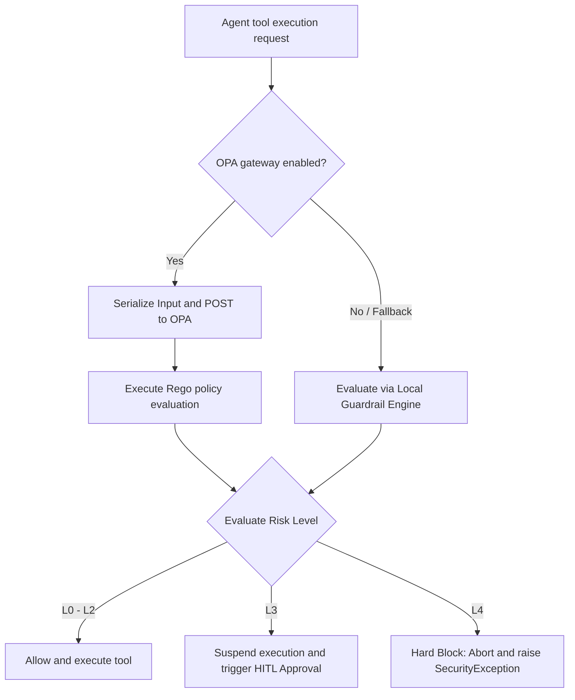

# OPA Security & Policy Manual (OPA & Rego)

This manual details the security isolation architecture, the **L0-L4 security risk tier system**, the local Abstract Syntax Tree (AST) static analysis scanning engine, and how to write dynamic **Open Policy Agent (OPA)** policies using Rego to intercept high-risk operations in AgentDeepDive.

---

## 1. Security Architecture and Paradigm

In agentic workflows where agents automatically write files and run system commands (`shell_exec`), security is paramount. To prevent agent hallucinations, erroneous actions, or malicious third-party script execution, the platform implements a dual-engine architecture featuring **"Local AST Guardrails + Dynamic OPA Micro-segmentation"**:



---

## 2. Risk Level Classifications (L0 - L4)

Every tool execution is dynamically evaluated and assigned a risk level from L0 to L4 based on its name, target path, command parameters, and shell syntax:

| Risk Level | Definition | Typical Scenarios | Mitigation Strategy |
| :--- | :--- | :--- | :--- |
| **L0** | Safe Read-only | List directories (`directory_list`), read file contents (`file_read`) | **Auto Allow**: Directly executes without auditing or rate-limiting. |
| **L1** | Safe Workspace Write | Modifying/creating code within the authorized workspace path | **Auto Allow**: Non-sensitive writes execute automatically. |
| **L2** | Safe CLI Operations | Standard shell commands with no risky tokens (e.g., `git status`, `pytest`) | **Direct Run / Whitelist**: Directly executed if matched against white-lists. |
| **L3** | Risky Execution (Suspended) | Modifying configuration files (`.env`, `pyproject.toml`); risky utilities (`rm`, `mv`, `curl`, `wget`, `ssh`) | **Human-in-the-Loop (HITL)**: Execution pauses; alerts are sent to Slack/Discord awaiting one-click approvals. |
| **L4** | High Danger (Hard Block) | Path traversals (`..`); writes outside workspace; root commands (`sudo`, `dd`, `chmod`, `nc`); tcp redirects; risky python imports | **Hard Intercept**: Terminate run immediately, mark node Red, and throw `SecurityException` to the agent. |

---

## 3. Local Guardrails & AST Scanning Engine

To prevent prompt injection bypasses using string concatenation or logical separators, the platform implements static AST analyses on command strings (defined in `src/core/governance/guardrails.py`):

### 3.1 Shell Syntax Splitting and Token Inspections
* **shlex Token Parsing**: Instead of parsing commands as flat strings, `shlex.shlex` decomposes compound commands containing junctions (`;`, `&&`, `||`, `|`) into independent command segments.
* **Variable Executions Blocked**: Command executions driven by variables (e.g., `$CMD` or `${CMD}`) are intercepted and assigned **L4 (Hard Block)**.
* **Redirection Verification**: Evaluates redirection targets (e.g., `> /etc/hosts` or `>> ../.env`) to ensure outputs stay strictly within the workspace boundaries.

### 3.2 Python Inline Script AST Scanning
When an agent attempts to run python scripts inline (`python -c "script"`), the engine intercepts the script and executes `ast.parse` to traverse the AST:
* **Module Import Restrictions**: Restricts importing modules like `os`, `subprocess`, `shutil`, `sys`, `pty`, `importlib`, `ctypes`, and `socket`.
* **Dangerous Call Interceptions**: Blocks calls to `eval()`, `exec()`, `__import__()`, `open()`, `compile()`, `globals()`, and `locals()`.
* **Dynamic Attributes Traversals**: Identifies attribute evaluations (e.g., `getattr()`) that attempt to dynamically resolve calls like `system`, `popen`, `rmtree`, `chmod`, `chown`, or `remove`.

---

## 4. OPA Rego Policy Development

When `security.opa.enabled` is set to `true` in `config.yaml`, evaluation decisions are delegated to the OPA server. Security administrators can modify `src/core/governance/policies/guardrails.rego` to manage governance rules.

### 4.1 OPA Input Schema

During evaluation, the platform constructs the following JSON format input for the OPA engine:

```json
{
  "input": {
    "tool_name": "shell_exec",
    "arguments": {
      "command": "rm -rf /"
    },
    "workspace_path": "/home/user/workspace/agentdeepdive",
    "whitelist_enabled": false,
    "whitelist_commands": [],
    "parsed_command": {
      "ast_risk": "L4"
    }
  }
}
```

### 4.2 Sample Rego Rules

Below are some declarative rules in `guardrails.rego`:

```rego
package guardrails

default risk_level = "L1"

# Rule 1: Path traversal on file write triggers L4
risk_level = "L4" {
    input.tool_name == "file_write"
    is_path_traversal(input.arguments.target_path)
}

# Rule 2: Sensitive config path write triggers L3
risk_level = "L3" {
    input.tool_name == "file_write"
    is_sensitive_write_path(input.arguments.target_path)
}

# Helper: Match sensitive configuration paths
is_sensitive_write_path(path) {
    re_match(".*\\.env$", path)
}
is_sensitive_write_path(path) {
    re_match(".*pyproject\\.toml$", path)
}
```

### 4.3 Customizing Policies
1. **Extend Forbidden Command Rules**: Modify `is_forbidden_command` to add custom patterns:
   ```rego
   is_forbidden_command(cmd) {
       re_match(".*\\b(curl|wget)\\b.*", cmd) # Intercept curls/wgets as forbidden L4 commands
   }
   ```
2. **Hot Reloading**: The engine automatically uploads the updated Rego policies to the OPA server during application checks, supporting **zero-downtime updates**.

---

## 5. Operations, Config, and Debugging

### 5.1 Activating Security in `config.yaml`
Configure the following keys in your global configuration file:

```yaml
security:
  opa:
    enabled: true
    url: "http://localhost:8181"   # OPA docker container listener port
  audit:
    cryptographic_integrity: true  # Enables tamper-proof cryptographic audit log files
```

### 5.2 Network Doctor Checks
To check OPA connection state, execute:
```bash
agentdeep doctor
```
If the connection is online, it displays `OPA Security Gateway: ONLINE`. If the connection fails, the platform **gracefully falls back** to the local guardrail engine, ensuring operations continue without downtime.

### 5.3 Audits and Logs
Whenever an operation is blocked by the gateway, the engine logs a structured entry:
```text
[2026-06-23 15:53:15] WARN guardrails: Guardrail block: Forbidden command pattern matched (command="sudo apt update")
```
These logs are streamed in real time to the Cockpit UI dashboard console for security review.
