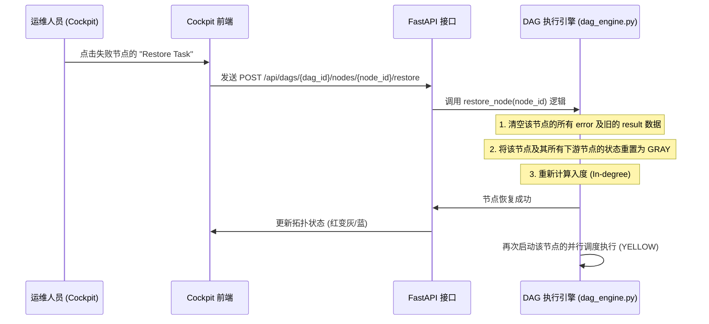

# Cockpit 仪表盘使用与扩展手册 (Cockpit Dashboard Guide)

本手册详细介绍了 AgentDeepDive 的 Cockpit 可视化大屏控制台的核心功能板块、人机协同（HITL）审批交互逻辑、**断点恢复 (Restore Task) 运行机制**，以及如何扩展前端拓扑组件与遥测视图。

---

## 一、 Cockpit 仪表盘简介

Cockpit 仪表盘基于 **React + Vite + TypeScript** 构建，采用 **React Flow** 渲染任务的拓扑关系网。它通过 **FastAPI WebSocket** 连接，接收来自后端的实时事件流（SSE），提供“玻璃舱”式全景实时状态感知。

### 1. 核心数据交互流

```text
+-------------------+             WebSocket (Log Event Stream)             +-----------------------+
|                   | <=================================================== |                       |
|                   |            HTTP POST (Restore / Approve)            |    FastAPI Server     |
|   Cockpit UI      | ---------------------------------------------------> |                       |
|   (React Flow)    |                                                      |  (src/api/routes/)    |
|                   | <--------------------------------------------------- |                       |
+-------------------+              HTTP GET (DAG & Skill State)            +-----------------------+
```

---

## 二、 核心控制面板详解

仪表盘前端采用了模块化的组件设计，各个控制板块的核心职责如下：

### 1. 任务控制大屏 (`MissionControl.tsx` & `CustomNode.tsx`)
* **拓扑渲染**：动态渲染有向无环图（DAG），展示节点之间的顺序和依赖链路。
* **自定义节点样式**：`CustomNode.tsx` 接管了 React Flow 节点的绘制，通过不同颜色的边框和呼吸灯效果直观反映节点在状态机中的位置（灰色：等待、蓝色：排队、黄色：执行、绿色：完成、红色：失败、橙色：待审批）。
* **悬浮遥测 (Hover Telemetry)**：将鼠标悬停在节点上，可以查看该节点的当前输入参数、执行耗时、输出的 JSON 数据以及关联的错误堆栈信息。

### 2. 审批闸口 (`ApprovalDialog.tsx` & `ApprovalGate.tsx`)
* 当某个节点由于命中 OPA 安全规则（如修改敏感配置）或技能声明（`approval_required: true`）触发 **L3 风险级**时，该节点将流转为橙色（`ORANGE`）并挂起。
* 审批对话框会弹窗呈现具体的执行参数（例如：Agent 试图执行的 Shell 命令或试图写入的目标代码）。
* 运维审核人员可点击 **"Approve" (批准)** 或 **"Reject" (驳回)** 进行硬性介入，决定任务流的生死。

### 3. 日志遥测面板 (`LogTelemetry.tsx`)
* 通过 WebSocket 实时拉取背景 Sentinel 守护进程和执行沙箱中输出的 Stdout/Stderr 日志。
* 支持日志搜索过滤、日志等级着色（INFO、WARN、ERROR）以及自动滚动跟踪，便于实时透视 Agent 的思考链（Chain of Thought）。

### 4. 规则配置与诊断 (`OpaPolicyDialog.tsx` & `DiagnosticsDialog.tsx`)
* **策略编辑器**：在前端快速调阅当前的 `guardrails.rego` 策略并检查规则语法。
* **环境自诊断**：一键调用 `agentdeep doctor` API，诊断本地 Docker 沙箱、PostgreSQL 数据库、Milvus 向量库、Redis 缓存的网络延迟与连通状态。

---

## 三、 断点恢复 (Restore Task) 运行机制

当 DAG 编排引擎中的某一个节点执行失败（变为红色 `RED`），系统默认会中断整个工作流的后续执行。Cockpit 提供了强大的**交互式断点恢复 (Restore Task)** 能力。

### 1. 恢复工作流机制流程



---

## 四、 前端扩展开发指南

如果您希望对控制台进行深度定制，可以参考以下开发步骤：

### 1. 自定义节点样式扩展 (`CustomNode.tsx`)
如果想在节点上展示自定义数据（例如当前节点的内存消耗或 CPU 占用率）：
1. 在 `CustomNode.tsx` 中修改 `data` 接口：
   ```typescript
   interface CustomNodeData {
     label: string;
     status: string;
     cpuUsage?: string;  // 新增 CPU 占用遥测显示
     // ...
   }
   ```
2. 在渲染模板中加入对应的标签和动画：
   ```tsx
   {data.cpuUsage && (
     <div className="text-xs text-gray-400 mt-1">
       CPU: <span className="text-neon-green">{data.cpuUsage}</span>
     </div>
   )}
   ```

### 2. 增加自定义工具结果的可视化视图
默认情况下，非文本文件只会在遥测悬浮窗中显示 JSON 路径。我们可以为常用的工具结果（例如 `file_write` 生成的 HTML 页面）在前端大屏右侧提供**实时渲染沙箱预览**：
1. 监听 WebSocket 事件流，判断事件的 `tool_name` 是否为 `file_write` 并且 `target_path` 以 `.html` 结尾。
2. 触发前端侧边栏挂载一个 `<iframe>` 节点，将生成的文件动态载入并实时渲染。这可以使用户在不需要打开宿主机浏览器的情况下直接在控制台上与 Agent 生成的网页（如贪吃蛇游戏）进行联调交互。

---

## 五、 部署、运行与调试

### 1. 依赖安装与本地运行
前端开发服务启动前，必须确保后端服务（Uvicorn）已正常运行在 `8000` 端口：
```bash
cd dashboard
npm install
npm run dev
```
开发服务器将默认监听 `http://localhost:5173` 并通过 `vite.config.ts` 中的 `server.proxy` 规则将 `/api` 和 `/ws` 请求反向代理至后端接口。

### 2. 常见问题排查 (FAQ)

* **问题一：拓扑图空白，控制台报错 WebSocket connection failed**
  * **解决方案**：检查后端 FastAPI 服务是否启动，网络连通性是否被防火墙阻断。如果是异地部署，请确认 `vite.config.ts` 中的代理目标（`proxy.target`）是否正确配置为后端服务器实际所在的 IP 地址。
* **问题二：点击 Restore Task 无响应或报 404**
  * **解决方案**：任务只有在失败状态（`RED`）或被手动挂起（`SUSPENDED`）时才能触发 Restore，请通过 hover telemetry 确认节点的当前状态颜色；并在后端查看 `server.log`，确认 alembic 数据库迁移是否完成，因为任务的状态恢复需要依赖数据库表（`dag_nodes`）的持久化数据写入。
