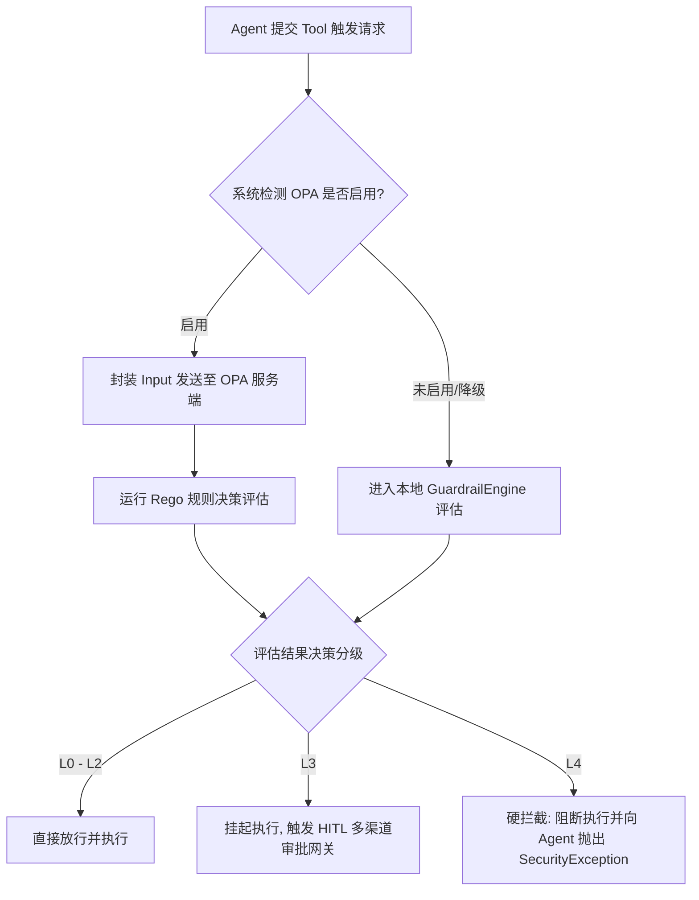

# OPA 安全合规微隔离配置手册 (OPA & Rego Policy Manual)

本手册详细介绍了 AgentDeepDive 的安全隔离架构、**L0-L4 级安全风险评估体系**、本地语法树 (AST) 深度扫描算法，以及如何利用 **Open Policy Agent (OPA)** 配合 Rego 规则动态拦截智能体（Agent）的高危越权操作。

---

## 一、 安全架构与设计理念

在面向大型超级工程的多智能体执行中，Agent 被赋予了自动读写文件与运行系统命令行（Shell Exec）的能力。为了防止 Agent 在运行态出现目标幻觉、误操作或执行恶意的第三方代码，平台设计了**“本地 AST 静态防御 + 动态 OPA 微隔离”**的双引擎安全治理架构：



---

## 二、 安全风险评估等级体系 (L0 - L4)

系统将每一次工具调用根据其参数、路径及危险性划分到 L0 至 L4 五个风险等级。各级别的安全管控策略定义如下：

| 风险级别 | 级别定义 | 典型触发场景 | 安全管控策略 |
| :--- | :--- | :--- | :--- |
| **L0** | 完全无风险只读 | 列目录 (`directory_list`)、读取文件 (`file_read`) | **自动放行**：不限次数与频率，不进行审计阻断。 |
| **L1** | 低风险写入 | 授权工作区路径内的常规文件创建与写入 (`file_write`) | **自动放行**：对普通文件和非系统关键位置的修改直接写入。 |
| **L2** | 中风险常规执行 | 无敏感参数的常规 Shell 命令（如 `git status`、`pytest` 等） | **白名单/直接放行**：命令匹配白名单或无危险行为则直接执行。 |
| **L3** | 高风险运行（挂起审批） | 修改敏感配置文件（`.env`、`pyproject.toml` 等）；中危 Shell 命令（`rm`, `mv`, `curl`, `wget`, `ssh` 等） | **人工介入 (HITL)**：暂停执行流，向 Slack/Discord/微信 等多通道推送卡片，等待人类决策者一键确认。 |
| **L4** | 极高风险（硬拦截） | 路径穿越（`..`）；写工作区外；高危系统命令（`sudo`, `dd`, `chmod`, `nc`）；`/dev/tcp` 端口重定向；非法 Python 模块导入 | **硬拦截**：彻底断开并抛出异常，强制将 Agent 的节点标红并触发错误溯源。 |

---

## 三、 本地语法树 (AST) 深度扫描防御

对于复杂的 Shell 与 Python 行内脚本执行，传统的正则表达式匹配极易被利用字符串拼接、多命令链连接等手段绕过。因此，平台内置了基于抽象语法树 (AST) 的静态代码安全扫描器（位于 `src/core/governance/guardrails.py`）：

### 1. Shell 命令行词法切分与 AST 分析
* **shlex 词法切分**：拒绝直接拼接，使用 `shlex.shlex` 语法树将整个多重管道/ conjunction 连接（`;`, `&&`, `||`, `|`）的复合命令拆解为独立的命令段落（Segments）。
* **禁止变量命令执行**：严防 `$CMD` 或 `${CMD}` 等由外部变量驱动的黑盒命令执行。一旦命令首个 token 为变量标识，强制判定为 **L4 (硬拦截)**。
* **高危管道与重定向**：扫描命令行中是否存在重定向输出至敏感位置，如 `> /etc/hosts` 或 `>> ../.env`，确保即使被重定向，目标地址也必须在工作区之内。

### 2. Python Inline 脚本语法树深度防御
当 Agent 试图通过 `python -c "script"` 执行 Python 逻辑时，安全引擎会自动剥离脚本并执行 `ast.parse` 构建抽象语法树。会对 AST 节点进行如下遍历审查：
* **模块导入防爆破**：全面禁止导入 `os`, `subprocess`, `shutil`, `sys`, `pty`, `importlib`, `ctypes`, `socket` 等敏感库。
* **函数调用黑名单**：禁止显式调用 `eval()`, `exec()`, `__import__()`, `open()`, `compile()`, `globals()`, `locals()`。
* **属性与方法扫描**：检测类似 `getattr()` 之后的动态属性获取，若被测属性中包含 `system`, `popen`, `rmtree`, `chmod`, `chown` 等方法，将被拦截并归为 **L4** 级风险。

---

## 四、 OPA Rego 策略配置实战

当 `config.yaml` 中的 `security.opa.enabled` 设置为 `true` 时，平台会将评估逻辑完全托管给 OPA 服务端。安全员可以通过修改 `src/core/governance/policies/guardrails.rego` 来定制企业安全合规规范。

### 1. OPA 输入契约 (Input Schema)

每次评估时，平台会封装以下格式的 JSON Input 发送至 OPA：

```json
{
  "input": {
    "tool_name": "shell_exec",
    "arguments": {
      "command": "rm -rf /"
    },
    "workspace_path": "/home/user/workspace/agentdeepdive",
    "whitelist_enabled": false,
    "whitelist_commands": [],
    "parsed_command": {
      "ast_risk": "L4"
    }
  }
}
```

### 2. Rego 经典规则解读

在 `guardrails.rego` 文件中，你可以定义类似如下的声明式规则：

```rego
package guardrails

default risk_level = "L1"

# 规则一：路径穿越写文件定义为 L4 (硬拦截)
risk_level = "L4" {
    input.tool_name == "file_write"
    is_path_traversal(input.arguments.target_path)
}

# 规则二：修改敏感工程配置定义为 L3 (需人工审批)
risk_level = "L3" {
    input.tool_name == "file_write"
    is_sensitive_write_path(input.arguments.target_path)
}

# 辅助函数：敏感路径匹配规则
is_sensitive_write_path(path) {
    re_match(".*\\.env$", path)
}
is_sensitive_write_path(path) {
    re_match(".*pyproject\\.toml$", path)
}
```

### 3. 如何扩展 OPA 规则

若要针对特定高频业务限制特定 API 请求或操作：
1. **添加禁用命令**：在 `is_forbidden_command` 中增加特定软件命令的正则特征：
   ```rego
   is_forbidden_command(cmd) {
       re_match(".*\\b(curl|wget)\\b.*", cmd) # 增加禁止内网拉取外部文件的审计规则
   }
   ```
2. **热更新加载**：更新 `guardrails.rego` 后，后端引擎会在下一次配置访问时自动将最新的 Rego 规则 PUT 覆盖至 OPA 服务器，实现**零停机、无感动态更新**。

---

## 五、 部署、运维与自检

### 1. 在 `config.yaml` 中配置安全参数
编辑您的全局配置文件 `config.yaml` 以激活防御引擎：

```yaml
security:
  opa:
    enabled: true
    url: "http://localhost:8181"   # OPA 服务端暴露的容器监听地址
  audit:
    cryptographic_integrity: true  # 开启防篡改密码学审计日志
```

### 2. 连接自检 (Doctor Check)
在终端运行诊断命令：
```bash
agentdeep doctor
```
系统会自检 OPA 服务器的连通性。如果连通，诊断信息中会显示 `OPA Security Gateway: ONLINE`；如果连接失败，平台将**自动无缝降级**为本地的静态 Guardrail 规则防护，确保系统稳定不中断。

### 3. 日志追踪与密码学审计
每次拦截高危操作后，安全网关均会生成一条结构化日志：
```text
[2026-06-23 15:53:15] WARN guardrails: Guardrail block: Forbidden command pattern matched (command="sudo apt update")
```
这些拦截信息会自动同步记录到 Cockpit 大屏的遥测监控面板中，便于系统安全主管进行快速追踪定位。
