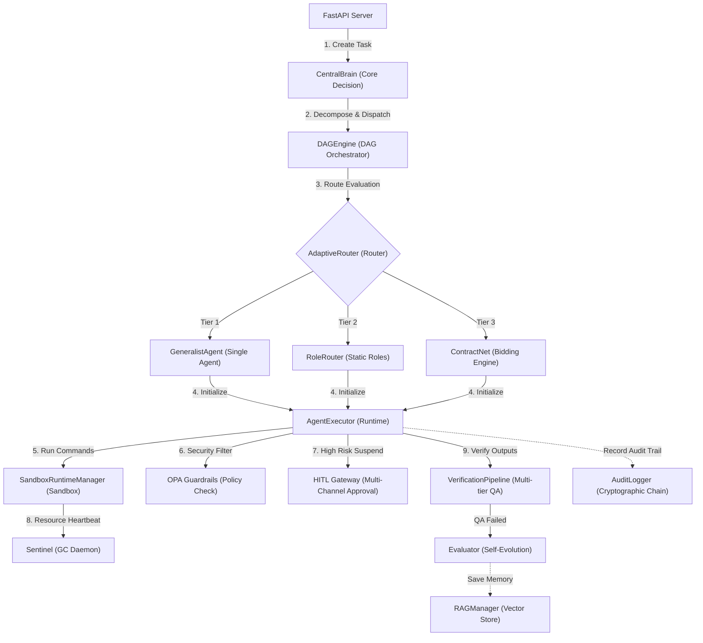

# AgentDeepDive Infrastructure & Core Modules Reference Manual (English)

This document is aimed at system developers, operators, and auditors, providing a comprehensive guide to the **infrastructure environments** and **application-level core modules** within the `AgentDeepDive` platform.

---

## 1. System Infrastructure Environments Reference

In standard distributed deployment mode, the platform utilizes the following physical/containerized middleware components:

### 1. Web Core & Execution Engine
*   **FastAPI & Uvicorn** (REST / WebSocket Async Web Server)
    *   **Role & Function**: Serves as the control plane API gateway. Handles multi-tenant JWT authorization, pushes real-time DAG logs via WebSocket, and mounts OPA policy dynamic reload endpoints.
*   **Celery & Celery Beat** (Distributed Task Queue & Scheduler)
    *   **Role & Function**: Offloads high-latency model inference, self-healing retries, and sandbox spawns into isolated worker processes to maintain high API responsiveness. Celery Beat polls the database periodically to dispatch cron-based workflow tasks.

### 2. Storage & Cache
*   **PostgreSQL** (Relational Metadata Store)
    *   **Role & Function**: The source of truth for metadata. Stores tenant profiles, fine-grained RBAC mappings, agent roles and skill packages, compiled DAG execution graphs, and cryptographic HMAC audit logs.
*   **Redis** (Distributed Bus & Shared Cache)
    *   **Role & Function**: Acts as the message broker for Celery queues; provides Redlock-based distributed mutual-exclusion locks and concurrency slot tracking; caches heartbeat statuses for active agents.
*   **Milvus & RAG Store** (Vector Database Store)
    *   **Role & Function**: Persists agent skills, knowledge base documents, and historic episodic memory. Supports multi-tenant isolated hybrid searches (BM25 + Cosine similarity) for context retrieval.

### 3. Security, Monitoring & Sandbox Hardening
*   **Open Policy Agent (OPA/Rego)** (Declarative Security Policy Engine)
    *   **Role & Function**: Provides micro-segmentation safety scans. Inspects agent-proposed CLI execution blocks via local REST calls, rejecting unsafe operations according to custom security policies.
*   **Docker & Kubernetes (gVisor/Firecracker)** (Micro-Isolated Sandbox Runtime)
    *   **Role & Function**: Spawns isolated execution runtimes. Restricts CPU, Memory, PIDs (default threshold: 100), and injects `no-new-privileges` flags to prevent sandbox escaping.
*   **Jaeger & OpenTelemetry** (Distributed Tracing APM)
    *   **Role & Function**: Captures end-to-end trace parameters across model invocations, OPA compliance scanning, and database transactions to assist developers in isolating performance bottlenecks.

---

## 2. Core Application Modules Reference

Core engine codes reside in `src/core/` and `src/evolution/` directories:

### 1. Core Brain Decision Center (`CentralBrain`)
*   **Location**: `src/core/brain/central_brain.py`
*   **Role**: Tracks active sessions, orchestrates bidding agreements via FIPA-ACL protocols, and controls execution budgets to prevent runaway token costs.

### 2. DAG Orchestrator & State Machine (`DAGEngine`)
*   **Location**: `src/core/dag/engine.py`
*   **Role**: Resolves tasks into topologically sorted branches. Manages execution timeouts, checkpoint state storage, and safe cleanup during cancellations.

### 3. Tri-Tier Adaptive Router (`AdaptiveRouter`)
*   **Location**: `src/core/agent/router.py`
*   **Role**: Directs task payloads based on complexity:
    *   **Tier 1 (Small)**: `GeneralistAgent`. Runs simple tasks with parent context compression to minimize token use.
    *   **Tier 2 (Medium)**: `RoleRouter`. Selects designated agents by skill match.
    *   **Tier 3 (Large)**: `ContractNet`. Orchestrates decentralized bid processes considering agent workload, capability, and model rates.

### 4. Sandbox Manager & Lifecycle Garbage Collector (`SandboxRuntimeManager` & `Sentinel`)
*   **Location**: `src/core/workspace/runtime.py` and `src/core/agent/pool.py`
*   **Role**:
    *   `SandboxRuntimeManager` spins up isolated containers or pods with fine-grained limits and PVC attachments.
    *   `Sentinel` continuously polls Docker labels and Redis heartbeats to clean up dangling or expired containers, mitigating memory leakage.

### 5. Multi-Tier QA Pipeline & Self-Evolution Flywheel (`VerificationPipeline` & `Evaluator`)
*   **Location**: `src/core/verification/pipeline.py` and `src/evolution/evaluator.py`
*   **Role**:
    *   `VerificationPipeline` checks code invariance, runs headless Playwright UI tests, and utilizes visual models (VLM) to verify frontend layouts.
    *   `Evaluator` runs multi-judge arbitration (Judge A/B/C + Security Officer Judge D) and handles A/B canary promotions to optimize system prompts.

### 6. Multi-Tenant Storage & Compliance Gateways (`RAGManager` & `OPAGuardrails`)
*   **Location**: `src/core/memory/rag_manager.py` and `src/core/security/opa_client.py`
*   **Role**:
    *   `RAGManager` maintains data boundaries across tenants and falls back to JSON mock stores in lightweight mode.
    *   `OPAGuardrails` strips dangerous commands via AST inspection and forwards parameters to OPA to enforce read-only scopes.

### 7. Cryptographic Audit Trail (`AuditLogger`)
*   **Location**: `src/core/security/audit.py`
*   **Role**: Signs audit trails using SHA-256 and HMAC. Triggers alerts and fail-closed state locks if any database alterations are detected.

### 8. HITL Approval Gateway (`HITL Gateway`)
*   **Location**: `src/core/approval/gateway.py`
*   **Role**: Halts high-risk flows and generates unified diff patches, pushing them to Slack/Telegram for manual one-click approvals.

---

## 3. Docker vs. Kubernetes Sandbox Selection & Integrations

`AgentDeepDive` supports both Docker and Kubernetes execution environments in `SandboxRuntimeManager`.

### 1. Decision Matrix

| Dimension | Docker Sandbox Mode (`mode: docker`) | Kubernetes Sandbox Mode (`mode: k8s`) |
| :--- | :--- | :--- |
| **Use Cases** | Local development, edge devices, fast integration testing | Production clusters, public/private clouds, multi-tenant SaaS |
| **Isolation** | Host namespace-level isolation | Strong isolation with gVisor sandbox kernel or microVMs |
| **Overhead** | Very Low. Container boots in $<1$s, negligible CPU overhead | Low to Medium. Pod scheduling takes $1 \sim 3$s |
| **Scalability** | Relies on local Docker daemon, no automated scaling | Native horizontal pod autoscaling (HPA) and failover self-healing |
| **Storage** | Local bind-mounts | Distributed persistent volumes with `ReadWriteMany` access (PVC) |

### 2. Runtime Module Integrations

Depending on the chosen mode, system components reconfigure their integration flows:

#### Option A: Docker Standalone Setup
*   **Logs & Stream**: API/Worker monitors standard streams via Unix sockets (`/var/run/docker.sock`).
*   **Network & OPA**: Sandboxes join a bridged network (`agentdeep-net`). `OPAGuardrails` reaches OPA at `http://opa:8181`.
*   **Sentinel GC**: Sentinel polls container list locally and removes expired containers with Docker API.

#### Option B: Kubernetes Native Setup
*   **Logs & Stream**: API/Worker uses K8s ServiceAccount to spin up pods. Logs are pulled via K8s WebSocket stream API (`v1.read_namespaced_pod_log`).
*   **Network & OPA**: Isolated Pods communicate via CoreDNS services. Pod scopes are limited using K8s **NetworkPolicy** to block access to the host or K8s control plane APIs.
*   **High-Availability Storage**: Active workloads utilize `ReadWriteMany` PVC. If a worker node is evicted, rescheduled pods reconnect to the same storage state.
*   **Sentinel GC**: Sentinel relies on K8s Pod Lifecycle (TTL/Annotations) and issues Pod Delete commands to avoid dangling container leakages.

---
⏱️ Update Time: 2026-06-24T15:56:00Z
