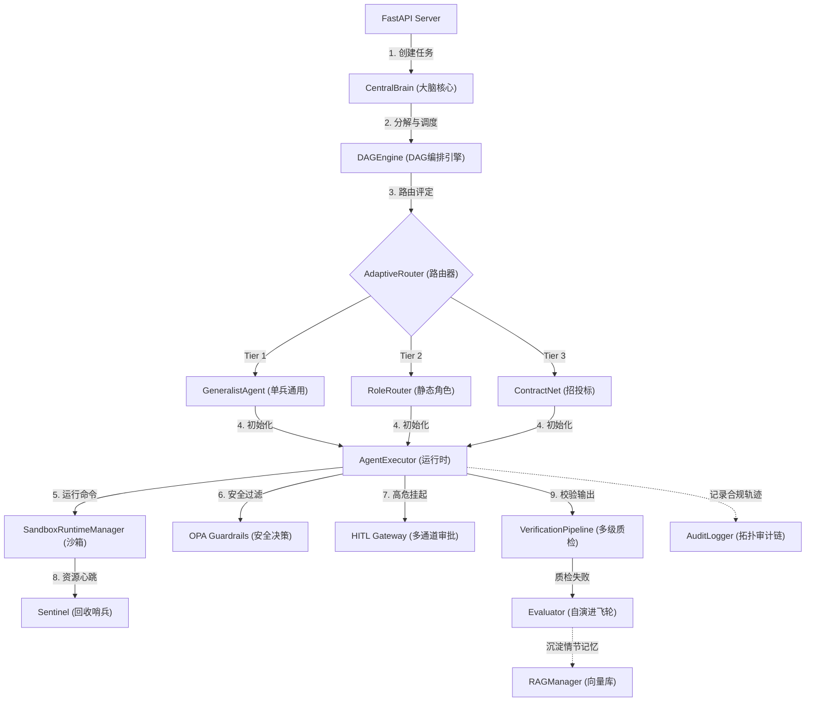

# AgentDeepDive 系统基础环境与核心功能模块科普手册 (Infrastructure & Core Modules Reference)

本文档面向系统开发、运维与审计人员，详尽梳理并科普了 `AgentDeepDive` 平台所依赖的**各基础服务环境**以及**项目中各核心功能模块**的角色与工作机制。

---

## 一、 系统基础服务环境说明 (Infrastructure Environments)

在标准分布式模式下，系统通过以下物理/容器化组件构建高可用中间件与隔离网络：

### 1. 核心运行与接口环境
*   **FastAPI & Uvicorn** (REST / WebSocket 异步 Web 服务器)
    *   **角色功能**：作为控制面接口，提供多租户 JWT 鉴权路由、WebSocket 状态总线（向 WebUI 实时推送 DAG 执行日志）以及 OPA 规则热重载挂载切面。
*   **Celery & Celery Beat** (分布式任务消费与定时触发器)
    *   **角色功能**：将高延迟的模型推理、自愈、安全沙箱拉起等计算密集型动作移至 Celery 独立 Worker 进程，保证 API 主进程高响应度；Celery Beat 负责定时轮询数据库，分发 Cron 编排任务。

### 2. 存储与状态缓冲环境
*   **PostgreSQL** (元数据关系型数据库)
    *   **角色功能**：平台唯一持久化数据账本。保存租户配置、细粒度 RBAC 权限表、智能体 Role 与 Skill 物理包、DAG 执行拓扑以及密码学 HMAC 审计日志备份链。
*   **Redis** (分布式高并发总线与缓存)
    *   **角色功能**：作为 Celery 的 Broker（消息代理）；提供基于 Redlock 算法的分布式文件锁与并发槽控制；提供 Sentinel 守护进程的 Agent 在线状态心跳缓存。
*   **Milvus & RAG Store** (向量数据库检索环境)
    *   **角色功能**：用于存储 Skills、Knowledge Base 与历史的情节记忆（Episodic Memory）。支持在租户隔离下进行混合 BM25 + 向量 Cosine 检索（Hybrid Search），实现 RAG 自愈。

### 3. 安全、观测与沙箱硬化环境
*   **Open Policy Agent (OPA/Rego)** (声明式安全决策微服务)
    *   **角色功能**：提供安全治理引擎。通过本地 REST 接口实时核查 Agent 准备执行的命令行是否被允许，在安全合规性上实施一票否决。
*   **Docker & Kubernetes (gVisor/Firecracker)** (物理微隔离沙箱运行时)
    *   **角色功能**：在内核级别提供防逃逸运行容器。支持根据 settings 进行细粒度的 CPU、Memory、PIDs（默认限额 100）及 `no-new-privileges` 防提权限制。
*   **Jaeger & OpenTelemetry** (全链路分布式追踪系统)
    *   **角色功能**：对 Agent 模型调用、OPA 扫描、数据库查询及 Celery 延迟进行 Tracer 抓取，以便开发人员直观追溯系统级性能瓶颈与异常链路。

---

## 二、 项目应用层核心功能模块说明 (Core Application Modules)

系统核心代码分布在 `src/core/` 及 `src/evolution/` 目录下，各模块分工清晰：

### 1. 中央大脑决策核心 (`CentralBrain`)
*   **物理定位**：`src/core/brain/central_brain.py`
*   **角色功能**：全局意志和决策中心。管控所有活动 DAG 会话的状态注册，协调 FIPA-ACL 契约网招投标的共识建立；结合三级资费模型（Token 消耗量）对 projected_cost 实施自动熔断防护。

### 2. 编排调度与状态机 (`DAGEngine`)
*   **物理定位**：`src/core/dag/engine.py`
*   **角色功能**：DAG 有向无环图的核心解析与调度引擎。将工程目标解析为拓扑序列并并发执行。支持异常时设为 `SUSPENDED` 并提前优雅退出的断点挂起机制，并提供级联 Cancel 预防协程泄露。

### 3. 三梯度自适应路由器 (`AdaptiveRouter`)
*   **物理定位**：`src/core/agent/router.py`
*   **角色功能**：根据任务复杂度及节点体量自动进行三级调度过滤：
    *   **Tier 1 (Small)**：通用单兵智能体 (`GeneralistAgent`)。整合 `Parent Context` 精确注入上下文，闭环极速运行，大幅节省 Token。
    *   **Tier 2 (Medium)**：名义角色路由 (`RoleRouter`)。按 Skill 相似度分发给特定角色。
    *   **Tier 3 (Large)**：去中心化契约网招投标 (`ContractNet`)。基于剩余预算、忙碌惩罚和模型能力对各 Agent 报价做评分竞争。

### 4. 容器沙箱与生命周期修剪 (`SandboxRuntimeManager` & `Sentinel`)
*   **物理定位**：`src/core/workspace/runtime.py` 与 `src/core/agent/pool.py`
*   **角色功能**：
    *   `SandboxRuntimeManager` 负责具体 Docker 容器或 K8s Pod 的拉起，动态注入安全限制与 PVC 挂载路径。
    *   `Sentinel` 哨兵作为常驻守护协程，通过 Redis 上的 Agent 心跳判定和物理 Docker Label 比对，对悬空的孤立容器及超期 Pod 实施物理 GC 强杀，防范宿主机资源耗尽。

### 5. 多级自动质检与自演进飞轮 (`VerificationPipeline` & `Evaluator`)
*   **物理定位**：`src/core/verification/pipeline.py` 与 `src/evolution/evaluator.py`
*   **角色功能**：
    *   `VerificationPipeline` 包含了“不变性断言”、“Playwright UI 自动化”及“VLM 视觉多模态核对”三道质检防线，杜绝界面跑通但功能失效的静默错误。
    *   `Evaluator` 引入多法官打分（A 格式/B 逻辑/C 仲裁）以及安全合规审计官 (Judge D)。安全低于 4.0 分即一票否决；评估打分通过后联动 A/B 灰度管理器派发 beta 变种，实现模型 Prompt 与代码策略的闭环自升级。

### 6. 多租户物理数据隔离与安全网关 (`RAGManager` & `OPAGuardrails`)
*   **物理定位**：`src/core/memory/rag_manager.py` 与 `src/core/security/opa_client.py`
*   **角色功能**：
    *   `RAGManager` 保证在物理 RAG 检索层面多租户数据的空间边界不混淆，且针对 `--lightweight` 提供全脱机 Mock 缓存引擎。
    *   `OPAGuardrails` 拦截智能体的工具调用，提取 AST 并将 workspace_path 传递给 OPA 决策， viewer 角色在 OPA 中被完全剥夺任何写权限，实现细粒度防越权。

### 7. 密码学只写哈希审计链 (`AuditLogger`)
*   **物理定位**：`src/core/security/audit.py`
*   **角色功能**：采用 SHA-256 + HMAC 拓扑哈希签名链。只要有任何行被物理删除或手动修改，哈希完整性校验即可实现毫秒级预警阻断，并结合 Fail-Closed 防御原则锁定备份层以防二次污染。

### 8. 人机协同审批网关 (`HITL Approval Gateway`)
*   **物理定位**：`src/core/approval/gateway.py`
*   **角色功能**：当 Agent 触发高风险操作时将其挂起，自动生成包含 unified format 补丁的代码 Diff，推送至 Slack/Telegram 等渠道由人类一键做出放行/拒绝决策。

## 三、 Docker 沙箱与 Kubernetes 沙箱的使用场景及模块搭配决策 (Docker vs. Kubernetes Selection)

`AgentDeepDive` 在 `SandboxRuntimeManager` 中同时支持 Docker 与 Kubernetes 两套沙箱隔离后端，其选型标准与运行协同规则如下：

### 1. 选型决策矩阵 (Decision Matrix)

| 维度 | Docker 沙箱模式 (`mode: docker`) | Kubernetes 沙箱模式 (`mode: k8s`) |
| :--- | :--- | :--- |
| **适用环境** | 单机开发环境、轻量边缘部署、本地快速集成测试 | 企业级生产集群、公有云/私有云大集群、多租户 SaaS 服务 |
| **隔离级别** | 宿主机共享内核 Namespace 级隔离 | gVisor (沙箱内核) / Kata Containers (安全虚拟机级) 强隔离 |
| **并发开销** | 极低。容器启动 $< 1$ 秒，CPU/内存损耗可忽略不计 | 较低至中等。Pod 调度与拉起约 $1 \sim 3$ 秒 |
| **高可用与扩展** | 依赖单机 Docker 守护进程，无法自动跨节点调度与水平缩容 | 集群原生支持 Service/Deployment 自动水平扩展 (HPA) 与故障自愈 |
| **存储方案** | 本地目录直接挂载 (`bind-mount`) | 跨节点高可用分布式共享卷挂载 (`ReadWriteMany` PVC) |

### 2. 运行时模块搭配与协同机制

当使用不同沙箱模式时，系统其他模块的联动调用链会自动重构：

#### 方案 A：Docker 单机运行搭配 (Standard Container Mode)
*   **通信与日志流追踪**：API 控制面与 Worker 计算面通过宿主机的 Unix Socket (`/var/run/docker.sock`) 直接与 Docker Daemon 交互，拉起沙箱容器，并通过标准 I/O 管道直接获取 stdout 日志流。
*   **网络隔离与 OPA**：沙箱加入由 Docker Compose 创建的统一桥接网络 (`agentdeep-net`)。安全网关 `OPAGuardrails` 拦截工具命令，发往本地容器 `http://opa:8181`。
*   **Sentinel GC 哨兵**：背景 Sentinel 协程在本地内存中轮询 `docker ps --filter "label=agentdeep-sandbox"`，提取超期容器 ID，直接调用 Docker API 进行 `docker rm -f` 强制物理清理。

#### 方案 B：Kubernetes 原生联邦搭配 (Cloud Native K8s Mode)
*   **通信与日志流追踪**：API 和 Worker 依靠集群内注入的 ServiceAccount (具备 Pod 操作的 RBAC 权限)，通过 `kubernetes` 官方 Python SDK 动态创建 K8s Pod 资源。日志追踪通过订阅 K8s 的 Pod Log WebSocket 流 (`v1.read_namespaced_pod_log`) 实现秒级传输。
*   **网络隔离与 OPA**：沙箱 Pod 拥有集群内独立 IP，系统通过配置 **Kubernetes NetworkPolicy (网络策略)**，实现 Pod 的微隔离，禁止沙箱 Pod 越权访问 K8s 控制面 (`10.96.0.1`) 或宿主机内网，同时与集群内的 `agentdeep-opa` 服务域名通信校验。
*   **存储高可用挂载 (PVC)**：使用共享的 `ReadWriteMany` 持久卷，API 容器、Worker 容器与动态生成的沙箱 Pod 均绑定挂载至此卷。当 Worker 节点因集群资源挤兑发生物理漂移重建时，工作空间数据实时同步，避免 Agent 上下文丢失。
*   **Sentinel GC 哨兵**：Sentinel 采用 K8s Pod Lifecycle (TTL/Annotations) 机制，定期向 APIServer 发起 Pod Delete 垃圾回收指令，防范因 K8s 网络阻塞造成的孤立 Pod 驻留。

---
⏱️ 计划更新时间：2026年06月24日15时54分17秒

