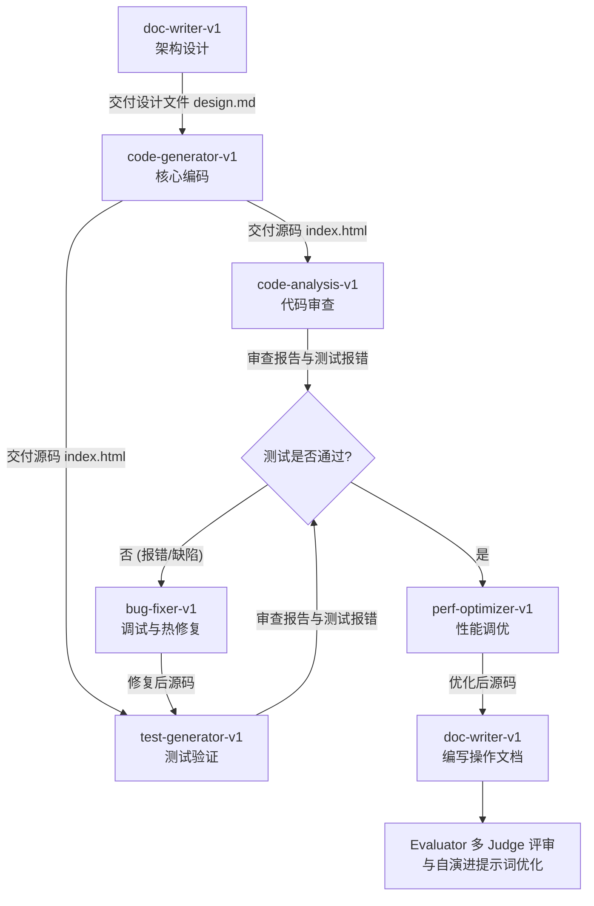

# 贪吃蛇游戏实战开发指南：体验 AgentDeepDive 的多 Agent 协同

为了让您能够全方位体验 `AgentDeepDive` 在多模型分流、DAG 编排、安全审计拦截、人工审批（Human-in-the-Loop）以及自演进飞轮上的表现，我们设计了本篇**从零构建「霓虹暗黑科技感贪吃蛇网页游戏」**的开发与测试演练。

---

## 1. 演练准备工作

1.  **启动基础设施与后台服务**：
    在终端中运行以下命令，确保 PostgreSQL、Redis 启动，且 API 服务运行在 `8000` 端口：
    ```bash
    # 启动 Redis / Postgres
    docker-compose -f docker/docker-compose.yml up -d
    
    # 启动 FastAPI 后台
    source .venv/bin/activate
    uvicorn src.api.main:app --host 0.0.0.0 --port 8000
    ```
2.  **配置大模型凭证 (.env)**：
    请确保您的 `.env` 中已经配置了可调用的模型。因为游戏开发需要较强的代码生成能力，推荐使用云端模型（如 `qwen3-coder:480b-cloud` 或 `deepseek-v3.1:671b-cloud`）。

---

## 2. 步骤一：提交并执行 DAG 任务编排

我们将通过一条命令提交预设的 `snake_game_dag.yaml` 并行编排图：
*   **设计节点 (design)**：使用 `doc-writer-v1` 编写霓虹风格的贪吃蛇规则并生成设计文档。
*   **编码节点 (code)**：依赖 `design` 节点，使用 `code-generator-v1` 编写单页 HTML 核心逻辑、CSS 样式及 JS 并写入文件。
*   **测试节点 (test)**：依赖 `code` 节点，使用 `test-generator-v1` 编写自动化 Python 静态分析脚本并调用 shell_exec 执行验证。

在终端中执行以下命令启动：
```bash
python3 src/cli/main.py dag execute --file docs/examples/snake_game_dag.yaml
```
系统会输出 DAG 成功初始化的消息及分配的 `DAG ID`。

---

## 3. 步骤二：跟踪节点运行状态与颜色流动

打开一个新的终端，定期输入以下命令，观察 DAG 节点生命周期的状态颜色变化：
```bash
python3 src/cli/main.py dag status snake-builder-dag
```
*   **Gray (未开始)** $\rightarrow$ **Blue (就绪/实例预热)** $\rightarrow$ **Yellow (运行中)**。
*   您将看到 `design` 节点首先进入 `yellow`。由于 `code` 节点依赖 `design`，它此时是 `gray` (未就绪)。

---

## 4. 步骤三：体验人机协同审批拦截 (Human-in-the-loop)

1.  当 `design` 节点执行完毕变为 `green` 后，`code` 节点拉起。
2.  因为 `code-generator-v1` 在配置中要求 `approval_required: true`（且其使用的 `file_write` 工具被 `GuardrailEngine` 标记为 `L3` 高风险写文件行为），**`code` 节点执行到一半会触发挂起，颜色变为 `orange` (Pending Approval) 并伴随呼吸灯闪烁。**
3.  **查看挂起审批**：
    输入以下命令查看待处理的授权申请：
    ```bash
    python3 src/cli/main.py approval list
    ```
    您将看到 `code` 节点写 `snake_game/index.html` 文件的具体请求与参数。
4.  **批准写入**：
    执行以下命令，向 Redis 通道发送放行信号：
    ```bash
    python3 src/cli/main.py approval approve <APPROVAL_ID>
    ```
    观察原运行终端，Agent 接收到批准信号，瞬间恢复运行，写入代码并顺利转换成 `green` (Success)！

---

## 5. 步骤四：产物审查与试玩游戏

任务流全部完成后（所有节点均变为 `green`），您的项目根目录下会自动创建 `snake_game/` 文件夹。

1.  **查看设计规范**：`cat snake_game/design.md`
2.  **验证测试报告**：`cat snake_game/verify.py`
3.  **试玩贪吃蛇**：
    *   在宿主机上，双击直接用浏览器打开 `snake_game/index.html`。
    *   体验其带有毛玻璃拟态、霓虹发光线条、计分板和重置按钮的高颜值网页贪吃蛇游戏。

---

## 6. 步骤五：体验自演进飞轮评价与诊断 (Self-evolution)

如果想测试我们的 Judge 和自优化器，您可以手动触发自演进打分机制。

在终端中输入（此处以评估生成的 index.html 内容为例）：
```bash
python3 src/cli/main.py evolution evaluate \
  --task-id "code-eval" \
  --task-desc "编写网页版单文件霓虹发光贪吃蛇" \
  --skill-id "code-generator-v1" \
  --output "$(cat snake_game/index.html)"
```
系统会触发 Judge A 与 Judge B 评分。
*   **若打分偏低 (< 0.6)**：系统会触发 `DiagnosticsEngine` 判定缺陷原因，并自动修改 `skills/code_generator/skill.yaml` 中的系统提示词，自动 bump 版本为 `1.0.1`，完成自演进闭环！

---

## 7. 深入理解：多 Agent 角色分配与协同流 (Agent Allocation & SDLC Collaboration)

在整个开发和质检生命周期中，`AgentDeepDive` 并不维持常驻的 Agent 进程。相反，系统维护着一个配置化的 **Skill 技能库**。每张 Skill 卡片即是 Agent 的“角色设定”与“工具箱限制”。中枢调度器通过以下矩阵动态指派并实例化 Agent：

### 7.1 SDLC Agent 职责分配矩阵

| 开发阶段 | 派发的 Agent 角色 | 绑定的 Skill ID | 授权核心工具 | 角色定位与具体职责 |
| :--- | :--- | :--- | :--- | :--- |
| **1. 需求设计** | **系统架构师 Agent** | `doc-writer-v1` | `file_write` | 分析任务输入，生成游戏规则、网格算法设计规范，写入 `design.md`。 |
| **2. 功能编码** | **全栈编码专家 Agent** | `code-generator-v1` | `file_write` | 根据设计规范，编写单文件 HTML 并封装 JS 渲染与逻辑，写入 `index.html`。 |
| **3. 安全审计** | **安全与合规审计 Agent** | `code-analysis-v1` | `file_read` | 以只读方式审查生成的源码，寻找潜在死循环与逻辑缺陷。 |
| **4. 测试验证** | **测试工程师 Agent** | `test-generator-v1` | `shell_exec` | 动态编写 Python 验证脚本并利用 `shell_exec` 在沙箱中执行，出具验证报告。 |
| **5. Bug 修复** | **代码调试专家 Agent** | `bug-fixer-v1` | `file_write` | 当测试或审计失败时被唤醒，定位报错根源并生成代码 Patch 覆写原文件。 |
| **6. 性能优化** | **调优与重构专家 Agent** | `perf-optimizer-v1` | `file_write` | 对已生成的代码进行复杂度分析，重构不必要的重绘逻辑以提升运行帧率。 |
| **7. 质量考评** | **多 Judge 评估法官** | `Evaluator` (自演进) | `litellm` 联合评审 | 在执行结束时对源码质量进行盲审打分（Consensus Scoring）。 |

### 7.2 多 Agent 协同流向示意

多 Agent 之间通过 DAG 的依赖关系和文件变更进行异步通信，其协同流向如下：



